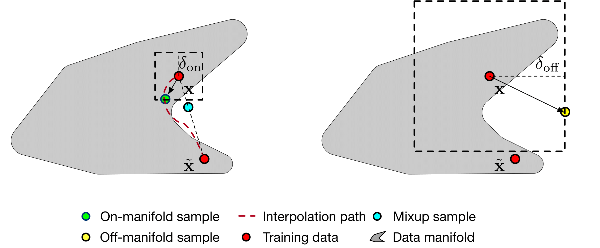

# Calibrated-BERT-Fine-Tuning
This repo contains our code for paper:

Calibrated Language Model Fine-Tuning for In- and Out-of-Distribution Data, EMNLP2020.

[[paper](https://arxiv.org/abs/2010.11506)] [[slides](https://www.dropbox.com/s/8ghg62se5u0zqrt/emnlp20-slides.pdf?dl=0)]


<div align=center></div>


## Training 
Training with BERT base:
```
CUDA_VISIBLE_DEVICES=0 python bert.py --dataset 20news-15 --seed 0
```
Training with manifold smoothing
```
CUDA_VISIBLE_DEVICES=0,1 python manifold-smoothing.py --dataset 20news-15 --seed 0 --eps_in 0.0001 --eps_out 0.001 --eps_y 0.1
```

## Evaluation
Evaluation with BERT base
```
python test.py --model base --in_dataset 20news-15 --out_dataset 20news-5 --index 0
```
Evaluation with temperature scaling [1] (based on the trained BERT-base model)
```
python test.py --model temperature --in_dataset 20news-15 --out_dataset 20news-5 --index 0
```
Evaluation with MC-dropout [2] (based on the trained BERT-base model)
```
python test.py --model mc-dropout --in_dataset 20news-15 --out_dataset 20news-5 --eva_iter 10 --index 0
```
Evaluation with manifold smoothing
```
python test.py --model manifold-smoothing --in_dataset 20news-15 --out_dataset 20news-5 --eps_in 0.0001 --eps_out 0.001 --eps_y 0.1
```

## References
[1] Guo, Chuan, Geoff Pleiss, Yu Sun, and Kilian Q. Weinberger. "On Calibration of Modern Neural Networks." In *international conference on machine learning*, pp. 1321-1330. 2017.

[2] Gal, Yarin, and Zoubin Ghahramani. "Dropout as a bayesian approximation: Representing model uncertainty in deep learning." In *international conference on machine learning*, pp. 1050-1059. 2016.